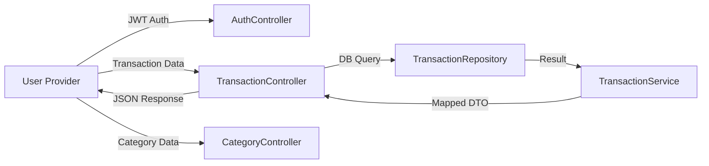
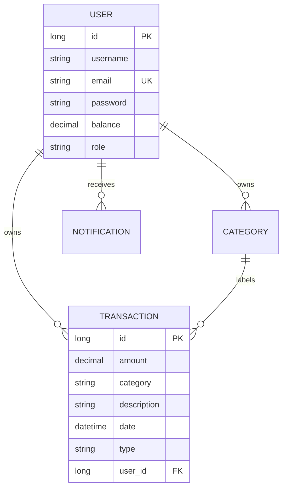

# FinTrack — Technical Documentation

## 1. System Architecture
FinTrack is built using a modern decoupled architecture:
- **Backend**: Spring Boot (Java) with RESTful API.
- **Database**: PostgreSQL for persistent storage.
- **Frontend**: Flutter (Dart) for Cross-Platform Mobile/Web.
- **Infrastructure**: Docker & Docker Compose.

---

## 2. Structural Diagrams

### 2.1 Use Case Diagram
Describes user interactions with the system.

```mermaid
useCaseDiagram
    actor User
    
    rectangle FinTrack {
        User --> (Register/Login)
        User --> (Manage Transactions)
        User --> (Manage Categories)
        User --> (View Monthly Stats)
        User --> (Receive Notifications)
        User --> (Auto-Login)
    }
```

### 2.2 Data Flow Diagram (Level 0)
Visualizes the flow of information between modules.



### 2.3 Entity Relationship Diagram (ERD)
Database schema overview.



---

## 3. API Documentation (RESTful)

| Method | Endpoint | Description | Auth |
|--------|----------|-------------|------|
| POST | `/api/auth/register` | User Registration | No |
| POST | `/api/auth/forgot-password` | Request password reset | No |
| POST | `/api/auth/reset-password` | Complete password reset | No |
| GET | `/api/transactions/{userId}` | Get user transactions | Yes |
| POST | `/api/transactions` | Create transaction | Yes |
| DELETE | `/api/transactions/{id}` | Delete transaction | Yes |
| GET | `/api/data/categories/{userId}` | Get user categories | Yes |
| POST | `/api/data/categories/{userId}` | Create category | Yes |
| GET | `/api/data/stats/{userId}` | Monthly stats | Yes |
| GET | `/api/users/{id}` | Get user profile | Yes |
| PUT | `/api/users/{id}` | Update user profile | Yes |
| POST | `/api/users/{id}/change-password` | Change user password | Yes |

---

## 4. Logging & Error Handling
FinTrack follows a multi-level logging strategy (Criteria 1.10):
- **INFO**: Successful business operations (Registration, Login, Transaction saved).
- **DEBUG**: Database queries, filter ranges, and intermediate processing steps.
- **WARN**: Security events (Invalid credentials, Duplicate registration).
- **ERROR**: Handled in `GlobalExceptionHandler` with full stack traces for unexpected failures.

---

## 5. Test Results Analysis
A total of **34+ tests** were implemented to ensure system reliability (Criteria 3.1 & 3.2).

- **Service Layer (24 tests)**: Validated core logic in Auth, Transaction, User, and Category services.
- **Controller Layer (10 tests)**: Verified REST endpoints, status codes, and JSON response formats for `AuthController` and `UserController`.

> [!TIP]
> All tests follow the Arrange-Act-Assert pattern and utilize Mockito for dependency isolation. All tests successfully passed.

---

## 6. Deployment Guide (Docker)
1. Ensure Docker Desktop is running.
2. Run `docker-compose up --build`.
3. The API will be available at `http://localhost:8080`.
4. Demo account: `demo@example.com` / `password123`.

